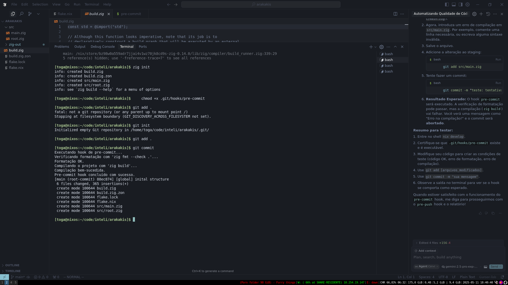

# Zig Project with Automated Git Hooks

This project demonstrates how to set up automated checks for a Zig project using Git hooks. These hooks act similarly to what [Husky](https://typicode.github.io/husky/) provides for Node.js projects, ensuring code quality and consistency before commits and pushes.

The project is managed using [Nix Flakes](https://nixos.wiki/wiki/Flakes) for a reproducible development environment.

## Project Goals

-   Ensure code is correctly formatted before committing.
-   Ensure the code compiles successfully before committing.
-   Ensure all tests pass before pushing to the remote repository.
-   Document the setup process (as seen in `relatorio-husky.md` - *to be created or translated*).

## Setup and Usage

### 1. Environment Setup (Nix Flakes)

This project uses Nix Flakes to provide a consistent development environment with Zig and related tools.

1.  **Install Nix:** If you don\'t have Nix, follow the installation guide at [nixos.org](https://nixos.org/download.html). Ensure you enable Flakes support.
2.  **Enter the Development Shell:** Navigate to the project\'s root directory in your terminal and run:
    ```bash
    nix develop
    ```
    This command will download the specified Zig version (and other tools like ZLS) and make them available in your shell\'s `PATH`.

### 2. Initialize Project (if starting fresh)

If you were to start a similar project from scratch (after `nix develop`):
```bash
zig init-exe
```
This creates a basic `build.zig` and `src/main.zig`.

### 3. Git Hooks

The Git hooks are located in the `.git/hooks/` directory. They are shell scripts that Git executes at specific points in the workflow.

**Important:** Ensure the hook scripts in `.git/hooks/` are executable:
```bash
chmod +x .git/hooks/pre-commit
chmod +x .git/hooks/pre-push  # (Once created)
```

#### a. `pre-commit` Hook

This hook runs automatically before you complete a `git commit`. It performs the following checks:

1.  **Code Formatting (`zig fmt --check .`):** Verifies that all Zig source code in the project is correctly formatted. If not, the commit is aborted, and you\'ll be prompted to run `zig fmt .` to fix the formatting.
2.  **Compilation (`zig build`):** Compiles the project. If there are any compilation errors, the commit is aborted.

**Script (`.git/hooks/pre-commit`):**
```sh
#!/bin/sh
# Pre-Commit Hook for Zig Projects

echo "Running pre-commit hook..."

# 1. Check code formatting
echo "Checking formatting with \'zig fmt --check .\'..."
if zig fmt --check . ; then
    echo "Formatting OK."
else
    echo "Formatting error! Run \'zig fmt .\' to fix."
    exit 1
fi

# 2. Compile the code
echo "Compiling the project with \'zig build\'..."
if zig build; then
    echo "Compilation successful."
else
    echo "Compilation error!"
    exit 1
fi

echo "Pre-commit hook completed successfully."
exit 0
```

#### b. `pre-push` Hook (To be implemented)

This hook will run automatically before you `git push` your changes to a remote repository. It is intended to:

1.  **Run Tests (`zig build test`):** Executes all unit tests defined in the project. If any test fails, the push is aborted.

*(The script for `pre-push` will be added here once created.)*

### 4. Seeing the Hooks in Action

To test the `pre-commit` hook:
1.  Make a change to `src/main.zig` that would cause a formatting or compilation error.
2.  Try to commit:
    ```bash
    git add src/main.zig
    git commit -m "test: trying to commit with an error"
    ```
3.  The hook should prevent the commit and show an error message.
4.  Fix the error (e.g., run `zig fmt .` or correct the compilation issue).
5.  Add the fix and commit again. This time, it should succeed.

**Screenshot of a Hook in Action:**

Replace the URL below with the link to your screenshot.


